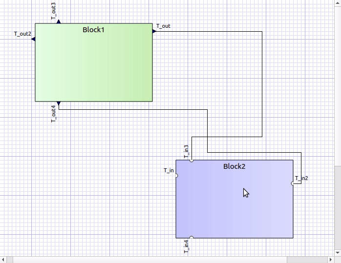

# BlockMod - a C++/Qt library for modelling of block-based networks and connector routing

## Goal and Vision

Block-based networks are needed for quite a few applications. When developing such an application, where users are allowed to create their own networks, you may need the following functionality:

- drawing of a network of blocks
- zooming/panning in the view
- showing sockets on the blocks (optionally with their labels)

User interaction:

- selecting/deselecting blocks and connections
- connect blocks by dragging lines from socket to socket
- moving blocks around, hereby keeping the connections and adjusting their geometry automatically

Take a look at the following animation, which illustrates the basic functionality:

Advanced features:

- defining block geometry and their socket types and positions; when modifying existing blocks keep connections previously made (except when a socket is removed)

## Programming Interface Concept

- access/retrieve data structure (the network)
- create/manipulate data structure via API (adding/removing blocks and connectors)
- serialize/deserialize data structure (read/write to xml stream and/or file)

Customizability:

- override default appearance/drawing of blocks, sockets and connectors
- create blocks with additional side effects (e.g. mouse hovering shows auxilliary attributes)

## Auxilliary features

- export view of network as vector graphics image/print to printer/PDF
- adjust style/view options

## Implementation Concepts

### Data structure
Data structure `Network` contains `Block` definitions. Each block may have several sockets, either input or output sockets. Sockets may be connected via `Connectors`, which also belong to the network.

Blocks, their sockets and connector can have custom properties, managed by property lists.

The data structure can be serialized in a json/xml representation.

### Visualization

The network is visualized in a QGraphicsView. The SceneManager generates/maintains the scene corresponding to a network. The scene manager provides default functions for generating graphics items for blocks, their sockets and the connectors. These generation functions can be overloaded to generate custom graphics items (with different visual appearance).

Default blocks can be simple rectangles, or svg/png icons. Default sockets are triangles or semi-circles, depending on inlet/outlet types.

The visualization can be switched between _connector-view_ and _connection graph_. The latter will not show sockets, but merely arrows between components with arrow heads indicating data flow direction.

### User Interaction

The framework can handle mouse-move events for blocks. This will automatically move connected connectors as well. Also, the different parts of a connector can be moved as well.

### Data synchronization

When graphics items are moved, the underlying data structure is updated directly (graphics items know their data storage counter parts via pointer links). For example, when moving a block, the connected connector items are modified (and the associated connector data structure as well).

When network is changed in the data structure, e.g. by adding/removing a block, the scene manager synchronizes to the new data structure, hereby only modifying those properties, that have actually changed.

## Implementation

Data members/objects refer to each other via pointer links. Care has to be taken, when modifying vectors/lists so that the pointer links are updated accordingly.

Note: when any of the vectors of the network's data structures change, the memory location of these blocks/connectors may become invalid. Graphics items still pointing to that memory may cause access violations. Thus, any change of network's data structures must yield an update of the respective Graphics items.

Hence, the scene manager also handles any changes to the underlying data structures and provides functions for adding/removing blocks, connectors, sockets etc.
